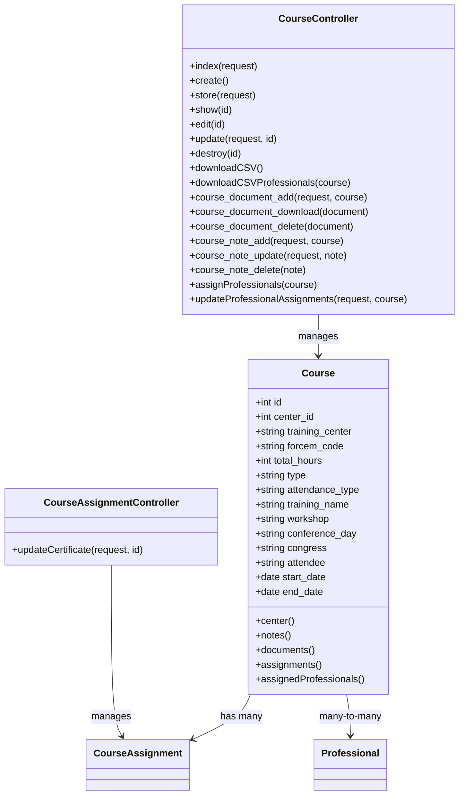

# Diagrama de Clases: Course, CourseController y CourseAssignmentController

## Descripción

- **Course**: Modelo que representa un curso de formación en el sistema. Contiene información sobre el curso, fechas, centro de formación, etc.

- **CourseController**: Controlador que maneja las operaciones CRUD para cursos, incluyendo gestión de documentos, notas y asignaciones de profesionales.

- **CourseAssignmentController**: Controlador específico para actualizar el estado de certificados en las asignaciones de cursos.

Los controladores utilizan los modelos correspondientes para realizar operaciones de base de datos.

## Explicación detallada en castellano

### Clase Course
Esta clase representa un curso de formación en el sistema de gestión. Hereda de `Model` de Laravel.

**Atributos principales:**
- `id`: Identificador único del curso.
- `center_id`: ID del centro al que pertenece el curso.
- `training_center`: Centro de formación.
- `forcem_code`: Código FORCEM.
- `total_hours`: Horas totales del curso.
- `type`: Tipo de curso.
- `attendance_type`: Modalidad (presencial, online, etc.).
- `training_name`: Nombre del curso.
- `workshop`, `conference_day`, `congress`: Detalles específicos del curso.
- `attendee`: Asistentes.
- `start_date`, `end_date`: Fechas de inicio y fin.

**Métodos importantes:**
- `center()`: Relación belongsTo con el modelo Center.
- `notes()`: Relación polimórfica morphMany con notas.
- `documents()`: Relación polimórfica morphMany con documentos.
- `assignments()`: Relación hasMany con asignaciones de curso (CourseAssignment).
- `assignedProfessionals()`: Relación many-to-many con profesionales asignados al curso.

### Clase CourseController
Este controlador maneja todas las operaciones relacionadas con los cursos en la aplicación web.

**Métodos principales:**
- `index()`: Lista cursos con paginación y búsqueda.
- `create()`: Muestra formulario para crear nuevo curso.
- `store()`: Guarda nuevo curso en BD.
- `show()`: Muestra detalles de un curso específico.
- `edit()`: Muestra formulario de edición.
- `update()`: Actualiza datos del curso.
- `destroy()`: Elimina un curso.
- `downloadCSV()`: Descarga CSV con lista de cursos.
- `downloadCSVProfessionals()`: Descarga CSV de profesionales asignados a un curso.
- `course_document_add()`: Sube documento al curso.
- `course_document_download()`: Descarga documento.
- `course_document_delete()`: Elimina documento.
- `course_note_add()`: Añade nota al curso.
- `course_note_update()`: Actualiza nota.
- `course_note_delete()`: Elimina nota.
- `assignProfessionals()`: Muestra formulario para asignar profesionales al curso.
- `updateProfessionalAssignments()`: Actualiza asignaciones de profesionales al curso.

### Clase CourseAssignmentController
Controlador específico para gestionar las asignaciones de cursos a profesionales.

**Métodos principales:**
- `updateCertificate()`: Actualiza el estado del certificado de una asignación (Pendent/Entregat).