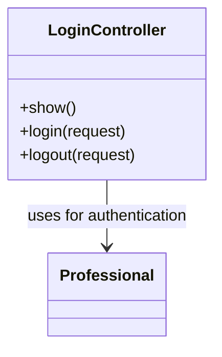

# Diagrama de Clases: LoginController

## Descripción

- **LoginController**: Controlador que maneja la autenticación de usuarios en el sistema. Gestiona el login, logout y muestra el formulario de login.

## Explicación detallada en castellano

### Clase LoginController
Este controlador se encarga de gestionar el proceso de autenticación de usuarios profesionales en la aplicación.

**Métodos principales:**
- `show()`: Muestra el formulario de login (vista 'login').
- `login(request)`: Procesa el POST del formulario de login. Valida las credenciales (usuario y contraseña), busca al profesional en la BD por username y estado activo, verifica la contraseña hasheada, y si es correcta, autentica al usuario manualmente usando Auth::login(), regenera la sesión por seguridad y redirige a la página home. Si las credenciales son incorrectas, vuelve atrás con un mensaje de error.
- `logout(request)`: Cierra la sesión del usuario actual usando Auth::logout(), invalida la sesión, regenera el token CSRF y redirige al formulario de login.

El controlador utiliza el modelo Professional para buscar y verificar las credenciales de los usuarios.