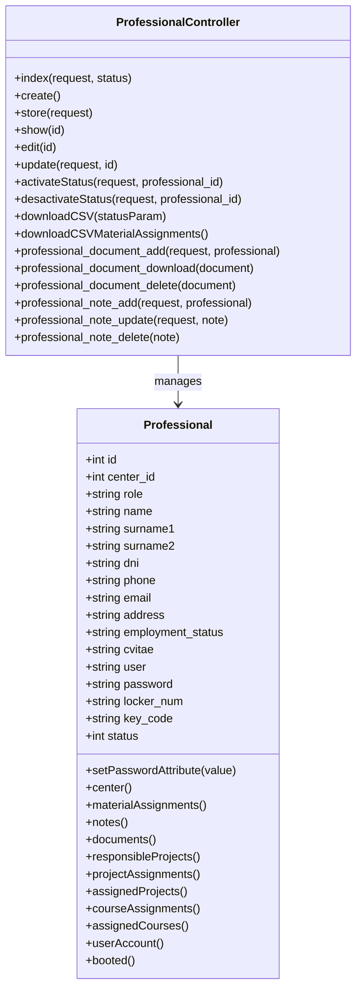

# Diagrama de Clases: Professional y ProfessionalController

## Descripción

- **Professional**: Modelo que representa a un profesional en el sistema. Extiende `Authenticatable` de Laravel. Contiene atributos para información personal, credenciales y relaciones con otros modelos como centros, asignaciones de material, proyectos, cursos, etc.

- **ProfessionalController**: Controlador que maneja las operaciones CRUD para profesionales, incluyendo gestión de documentos y notas asociadas.

El controlador utiliza el modelo Professional para realizar operaciones de base de datos.

## Explicación detallada en castellano

### Clase Professional
Esta clase representa a un profesional en el sistema de gestión. Hereda de `Authenticatable`, lo que significa que puede autenticarse en el sistema (login/logout).

**Atributos principales:**
- `id`: Identificador único del profesional.
- `center_id`: ID del centro al que pertenece.
- `role`: Rol o cargo del profesional.
- `name`, `surname1`, `surname2`: Nombre completo.
- `dni`: Documento de identidad.
- `phone`, `email`, `address`: Datos de contacto.
- `employment_status`: Estado laboral (ej: Activo, No contratado).
- `cvitae`: Currículum vitae.
- `user`, `password`: Credenciales de acceso (usuario y contraseña hasheada).
- `locker_num`, `key_code`: Número de taquilla y código de llave.
- `status`: Estado activo/inactivo (1/0).

**Métodos importantes:**
- `setPasswordAttribute()`: Mutador que automáticamente hashea la contraseña cuando se asigna.
- `center()`: Relación belongsTo con el modelo Center (pertenece a un centro).
- `materialAssignments()`: Relación hasMany con asignaciones de material.
- `notes()`: Relación polimórfica morphMany con notas.
- `documents()`: Relación polimórfica morphMany con documentos.
- `responsibleProjects()`: Proyectos/comisiones donde es responsable.
- `projectAssignments()`: Asignaciones a proyectos donde participa.
- `assignedProjects()`: Relación many-to-many con proyectos asignados.
- `courseAssignments()`: Asignaciones a cursos.
- `assignedCourses()`: Relación many-to-many con cursos asignados.
- `userAccount()`: Relación hasOne con el modelo User (cuenta de usuario asociada).
- `booted()`: Método estático que crea automáticamente una cuenta de usuario cuando se crea un profesional y la elimina cuando se borra.

### Clase ProfessionalController
Este controlador maneja todas las operaciones relacionadas con los profesionales en la aplicación web. Sigue el patrón MVC de Laravel.

**Métodos principales:**
- `index()`: Lista profesionales activos/inactivos con paginación y búsqueda.
- `create()`: Muestra formulario para crear nuevo profesional.
- `store()`: Valida y guarda nuevo profesional en BD.
- `show()`: Muestra detalles de un profesional específico.
- `edit()`: Muestra formulario de edición.
- `update()`: Valida y actualiza datos del profesional.
- `activateStatus()`: Activa el estado de un profesional.
- `desactivateStatus()`: Desactiva el estado de un profesional.
- `downloadCSV()`: Descarga CSV con lista de profesionales por estado.
- `downloadCSVMaterialAssignments()`: Descarga CSV con asignaciones de material.
- `professional_document_add()`: Sube un documento asociado al profesional.
- `professional_document_download()`: Descarga un documento.
- `professional_document_delete()`: Elimina un documento.
- `professional_note_add()`: Añade una nota al profesional.
- `professional_note_update()`: Actualiza una nota existente.
- `professional_note_delete()`: Elimina una nota.

El controlador valida datos de entrada, maneja autenticación/autorización, y redirige con mensajes de éxito/error.